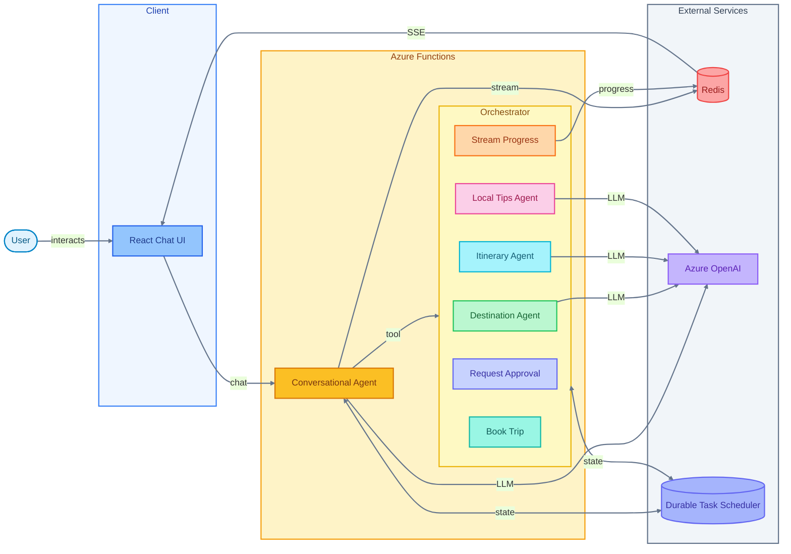

# Travel Planner Architecture

## System Diagram

## How It Works

1. **User chats** with the React UI
2. **Conversational Agent** (Durable Entity) gathers travel details via natural conversation
3. When ready, agent **starts the Orchestrator** (Durable Function)
4. Orchestrator runs **Specialized AI Agents** (Destination, Itinerary, Local Tips)
5. Progress **streams via Redis** back to the UI in real-time
6. User **approves** the plan → booking confirmation

## Key Components

| Component | Purpose |
|-----------|---------|
| **Conversational Agent** | Collects travel info through chat |
| **Orchestrator** | Coordinates AI agents, handles approval flow |
| **Specialized AI Agents** | Generate destinations, itineraries, local tips |
| **Redis Streams** | Reliable real-time progress streaming |
| **Durable Task Scheduler** | Persists agent & orchestration state |
| **External** | Redis, Blob, DTS, OpenAI | Streaming, storage, state, AI |

## Key Flows

### 1. Chat Flow
1. User sends message → API receives → Durable Agent processes
2. Agent streams response tokens → Redis Stream → SSE → Frontend

### 2. Trip Planning Flow
1. Agent collects info → Calls `PlanTripTool` → Starts orchestration
2. Orchestration runs specialized agents in parallel
3. Progress updates stream via activities → Redis → SSE → Frontend
4. User approves → `RespondToTravelPlan` → `RaiseEventAsync` → Booking completes

### 3. Reliable Streaming
- Redis Streams provide durable, cursor-based message delivery
- Frontend can reconnect and resume from last cursor
- Orchestration progress streams through the same SSE connection